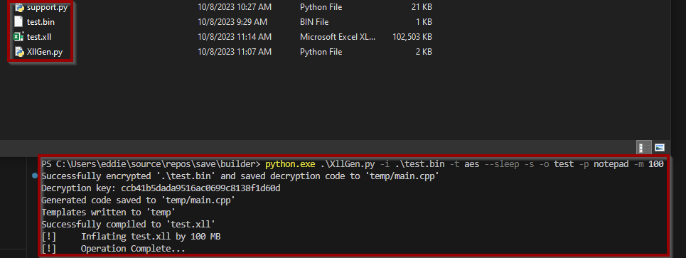
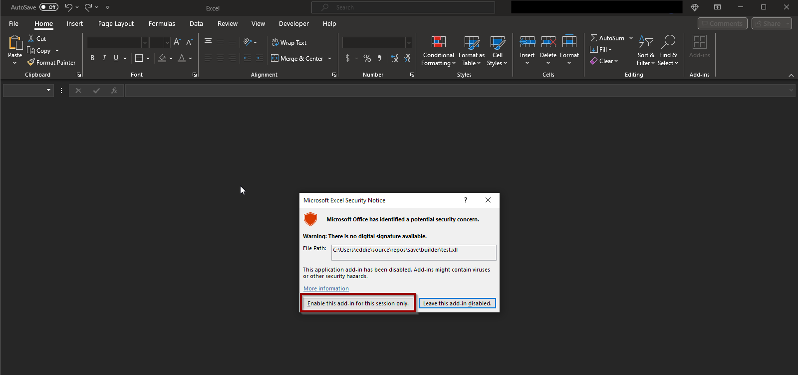
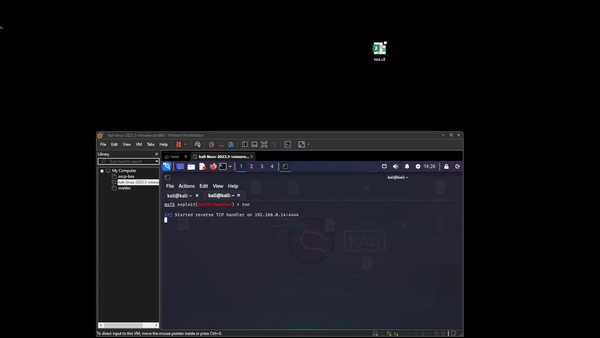

# Xll-Payload-Generator

Payload generator for XLL files (Excel Add in). Usage includes AES encryption, process injection, sleep, sandbox, inflate. This does not currently bypass anything but does execute. 

Process Injection defaults to explorer, but I think OneDrive would be the best targets in a real world scenario.

Todo:
Direct Syscalls
Alternative Encryption Methods
Packing into ZIP/ISO

#### Requirements
> g++

## Credits

Malware development credits: [@kyle41111](https://github.com/kyle41111)

## Usage
```
usage: XllGen.py [-h] -i INPUT [-t {aes,none}] [-k KEY] [-s] [--sand] [--inflate INFLATE] -o OUTPUT [-p PROCESS]

Encrypt a binary file and generate C++ code.

optional arguments:
  -h, --help            show this help message and exit
  -i INPUT, --input INPUT
                        Path to the input binary file
  -t {aes,none}, --type {aes,none}
                        Encryption type (aes or none)
  -k KEY, --key KEY     Will generate if not supplied. Encryption key (128-bit AES key in hexadecimal)
  -s, --sleep           Add sleep function
  --sand                Add sandbox function
  --inflate INFLATE, -m INFLATE
                        Inflate Size (Specify MB Size)
  -o OUTPUT, --output OUTPUT
                        Output XLL file name
  -p PROCESS, --process PROCESS
                        Name of the target process (default: 'explorer')
```

### Testing with msfvenom
Must have EXITFUNC=thread  
Most C2's have this built in

## Compile Example

   
```.\XllGen.py -i .\test.bin -t aes --sleep -s -o test -p notepad -m 100```  
        
## Victim's Excel Prompt

         
## Example Execution

